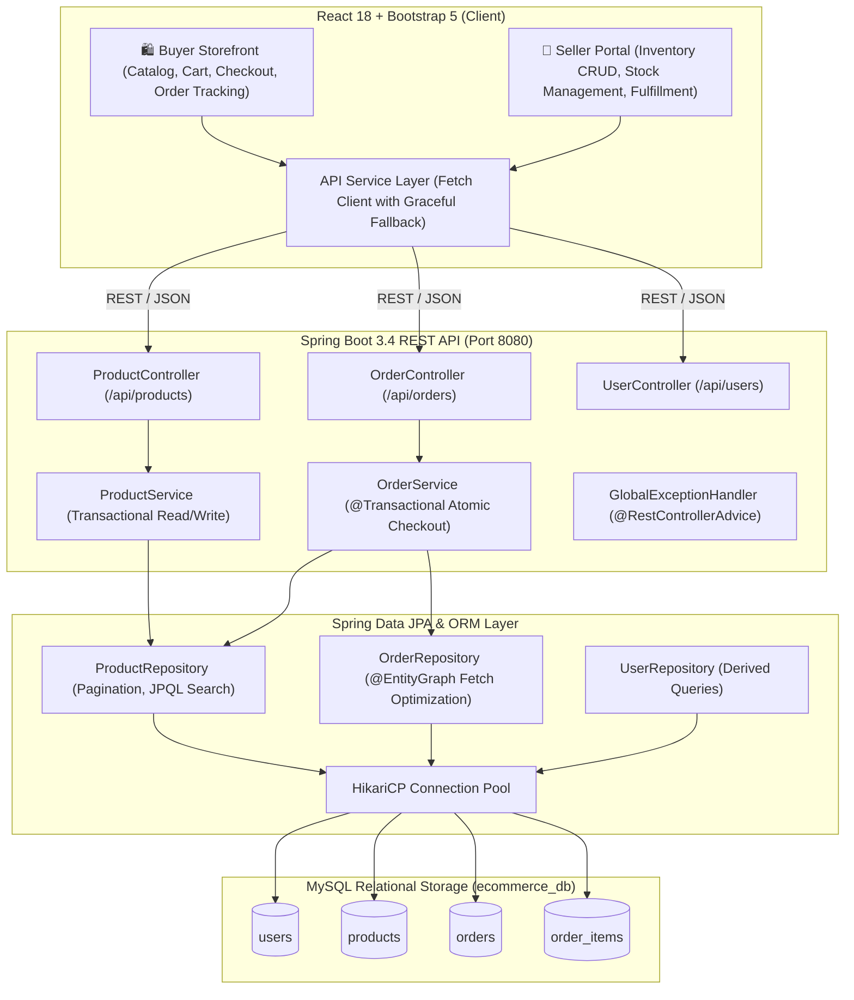

# ⚡ NexusTech &mdash; Enterprise Full-Stack E-Commerce Platform

[](https://www.oracle.com/java/)
[](https://spring.io/projects/spring-boot)
[](https://spring.io/projects/spring-data-jpa)
[](https://www.mysql.com/)
[](https://react.dev/)
[](https://getbootstrap.com/)
[](https://vitejs.dev/)

An enterprise-grade, full-stack E-Commerce application designed to demonstrate the transition from traditional manual JDBC/Hibernate XML configurations to **Spring Boot 3, Spring Data JPA, HikariCP, and component-based React 18**.

Built with dual **Role-Based Access Perspectives**: a customer-facing B2C storefront and an operator-grade merchant back-office.

---

## 🏛️ System Architecture



---

## 🌟 Key Features

### 🛍️ 1. Buyer Experience (`Customer View`)
- **Product Discovery**: Dynamic catalog with instant search, category pills, price sorting, and stock status indicators.
- **Product Inspection**: Quick-view modal with high-res imagery, technical specifications, and inventory count.
- **Cart Management**: Offcanvas shopping drawer with quantity steppers, subtotal computation, estimated taxes, and free delivery badges.
- **Checkout Flow**: Validated checkout with multiple shipping presets, simulated payment methods, and immediate order placement.
- **Real-Time Order Tracking**: Customer order history with live status updates (`PENDING`, `PAID`, `SHIPPED`, `DELIVERED`, `CANCELLED`) and self-service cancellation with inventory refund.

### 🏪 2. Shop Owner Experience (`Seller Portal`)
- **Executive Metrics**: Live KPI cards for total products listed, available units in stock, low-stock alerts, customer order count, and gross volume.
- **Product Publishing**: "+ List New Product" modal with image URL presets, dynamic category creation, price validation, and stock allotment (`POST /api/products`).
- **Inventory Control**: Real-time catalog table with inline editing (`PUT /api/products/{id}`) and catalog removal (`DELETE /api/products/{id}`).
- **Order Fulfillment**: Dedicated fulfillment stream allowing merchants to transition customer order lifecycles (`PENDING` &rarr; `PAID` &rarr; `SHIPPED` &rarr; `DELIVERED`).

---

## 🗄️ Database Schema & Relational Design

The application uses an InnoDB MySQL schema with strict foreign keys and precision constraints:

```sql
CREATE DATABASE IF NOT EXISTS ecommerce_db;
USE ecommerce_db;

-- 1. Users Table
CREATE TABLE users (
    id BIGINT AUTO_INCREMENT PRIMARY KEY,
    email VARCHAR(150) NOT NULL UNIQUE,
    password_hash VARCHAR(255) NOT NULL,
    first_name VARCHAR(50) NOT NULL,
    last_name VARCHAR(50) NOT NULL,
    role ENUM('ROLE_CUSTOMER', 'ROLE_ADMIN') DEFAULT 'ROLE_CUSTOMER',
    created_at TIMESTAMP DEFAULT CURRENT_TIMESTAMP,
    INDEX idx_user_email (email)
) ENGINE=InnoDB;

-- 2. Products Table
CREATE TABLE products (
    id BIGINT AUTO_INCREMENT PRIMARY KEY,
    name VARCHAR(200) NOT NULL,
    description TEXT,
    price DECIMAL(10, 2) NOT NULL,
    stock_quantity INT NOT NULL DEFAULT 0,
    image_url VARCHAR(500),
    category VARCHAR(100),
    created_at TIMESTAMP DEFAULT CURRENT_TIMESTAMP,
    updated_at TIMESTAMP DEFAULT CURRENT_TIMESTAMP ON UPDATE CURRENT_TIMESTAMP,
    INDEX idx_product_category (category)
) ENGINE=InnoDB;

-- 3. Orders Header Table
CREATE TABLE orders (
    id BIGINT AUTO_INCREMENT PRIMARY KEY,
    user_id BIGINT NOT NULL,
    order_date TIMESTAMP DEFAULT CURRENT_TIMESTAMP,
    total_amount DECIMAL(10, 2) NOT NULL,
    status ENUM('PENDING', 'PAID', 'SHIPPED', 'DELIVERED', 'CANCELLED') DEFAULT 'PENDING',
    shipping_address VARCHAR(255) NOT NULL,
    CONSTRAINT fk_order_user FOREIGN KEY (user_id) REFERENCES users(id) ON DELETE RESTRICT,
    INDEX idx_order_user (user_id)
) ENGINE=InnoDB;

-- 4. Order Items (Bridge Table)
CREATE TABLE order_items (
    id BIGINT AUTO_INCREMENT PRIMARY KEY,
    order_id BIGINT NOT NULL,
    product_id BIGINT NOT NULL,
    quantity INT NOT NULL,
    unit_price DECIMAL(10, 2) NOT NULL,
    subtotal DECIMAL(10, 2) NOT NULL,
    CONSTRAINT fk_item_order FOREIGN KEY (order_id) REFERENCES orders(id) ON DELETE CASCADE,
    CONSTRAINT fk_item_product FOREIGN KEY (product_id) REFERENCES products(id) ON DELETE RESTRICT,
    INDEX idx_item_order (order_id),
    INDEX idx_item_product (product_id)
) ENGINE=InnoDB;
```

---

## 📡 REST API Reference

### Products API (`/api/products`)
| Method | Endpoint | Description |
| :--- | :--- | :--- |
| `GET` | `/api/products` | Retrieve paginated products with category and keyword search filters |
| `GET` | `/api/products/{id}` | Retrieve single product details by ID |
| `GET` | `/api/products/categories` | Retrieve all distinct categories |
| `POST` | `/api/products` | Publish a new product to the catalog (Seller) |
| `PUT` | `/api/products/{id}` | Update product details, price, or inventory (Seller) |
| `DELETE`| `/api/products/{id}` | Remove a product from the catalog (Seller) |

### Orders API (`/api/orders`)
| Method | Endpoint | Description |
| :--- | :--- | :--- |
| `POST` | `/api/orders` | Place a new order with atomic inventory deduction |
| `GET` | `/api/orders/{id}` | Retrieve order details and line items by ID |
| `GET` | `/api/orders/user/{userId}` | Retrieve all orders placed by a specific user |
| `PATCH` | `/api/orders/{id}/status?status=...` | Update order lifecycle status (with inventory refund if cancelled) |

---

## 💡 Senior Engineering Highlights

1. **Transactional Integrity (`@Transactional`)**:
   Order placement executes within an atomic transaction. If inventory is insufficient for any requested item, the entire transaction rolls back cleanly, preventing partial inventory deductions.
2. **Elimination of N+1 Queries (`@EntityGraph`)**:
   In `OrderRepository`, `@EntityGraph(attributePaths = {"orderItems", "orderItems.product", "user"})` instructs Hibernate to issue a single SQL `LEFT JOIN` query instead of issuing *1 + N* queries.
3. **Decoupled DTO Layer**:
   JPA Entities are never directly exposed through REST controllers. Request and Response DTOs enforce JSR-380 validation (`@NotBlank`, `@DecimalMin`, `@Min`) and eliminate Jackson circular reference loops.
4. **OSIV Disabled (`spring.jpa.open-in-view=false`)**:
   Enforces strict separation of concerns, ensuring all database access and proxy initializations happen inside the transactional service layer rather than leaking into HTTP view rendering.
5. **Resilient Frontend with Graceful Fallback**:
   The frontend client dynamically detects Spring Boot health on port `8080`. When connected, it routes to live MySQL; when offline, it seamlessly provides simulated in-memory state so UI workflows remain testable.

---

## 🚀 Getting Started

### Prerequisites
- **Java**: JDK 17 or higher
- **Maven**: 3.8+
- **Node.js**: 18+ (tested on Node 24)
- **MySQL**: 8.0+

---

### Step 1: Backend Setup (Spring Boot)

1. Clone the repository:
   ```bash
   git clone https://github.com/ganesh-badar/nexus-ecommerce-platform.git
   cd nexus-ecommerce-platform/backend
   ```

2. Configure database credentials in `src/main/resources/application.properties`:
   ```properties
   spring.datasource.url=jdbc:mysql://localhost:3306/ecommerce_db?useSSL=false&serverTimezone=UTC&allowPublicKeyRetrieval=true
   spring.datasource.username=root
   spring.datasource.password=your_mysql_password
   ```

3. Build and run the backend:
   ```bash
   mvn clean spring-boot:run
   ```
   *The server starts on `http://localhost:8080`. Sample products and users will seed automatically on first launch via `DataSeeder`.*

---

### Step 2: Frontend Setup (React + Vite)

1. Open a new terminal in the `frontend` folder:
   ```bash
   cd nexus-ecommerce-platform/frontend
   ```

2. Install dependencies:
   ```bash
   npm install
   ```

3. Launch the development server:
   ```bash
   npm run dev
   ```
   *Open `http://localhost:5173` in your browser.*

---

## 📂 Project Structure

```
nexus-ecommerce-platform/
├── README.md
├── .gitignore
├── backend/
│   ├── pom.xml
│   └── src/main/
│       ├── java/com/ganesh/ecommerce/
│       │   ├── EcommerceApplication.java
│       │   ├── config/          # WebConfig (CORS), DataSeeder
│       │   ├── controller/      # ProductController, OrderController, UserController
│       │   ├── dto/             # Request & Response DTOs with validation
│       │   ├── exception/       # GlobalExceptionHandler, Custom Exceptions
│       │   ├── model/           # User, Product, Order, OrderItem JPA Entities
│       │   ├── repository/      # UserRepository, ProductRepository, OrderRepository
│       │   └── service/         # ProductService, OrderService
│       └── resources/
│           └── application.properties
└── frontend/
    ├── package.json
    ├── vite.config.js
    ├── index.html
    └── src/
        ├── App.jsx
        ├── index.css            # Dark theme, glassmorphism tokens
        ├── components/
        │   ├── Navbar.jsx               # Role toggle, search, cart trigger
        │   ├── HeroBanner.jsx           # Store highlights & perks
        │   ├── CategoryFilter.jsx       # Category pills & price sorting
        │   ├── ProductCard.jsx          # Product card with stock badges
        │   ├── ProductDetailsModal.jsx  # Detailed product inspection
        │   ├── CartDrawer.jsx           # Offcanvas cart & tax breakdown
        │   ├── CheckoutModal.jsx        # Multi-option address & payment form
        │   ├── OrdersModal.jsx          # Customer order history & tracking
        │   ├── SellerDashboard.jsx      # Merchant KPIs, inventory table, fulfillment
        │   ├── AddProductModal.jsx      # New product listing with image presets
        │   ├── EditProductModal.jsx     # Price and stock adjustments
        │   └── ToastNotification.jsx    # Real-time feedback alerts
        └── services/
            └── api.js                   # API client with health checking
```

---

## 👨‍💻 Author
**Ganesh Kumar**
- GitHub: [@ganesh-badar](https://github.com/ganesh-badar)
- Email: [ganeshbadar01@gmail.com](mailto:ganeshbadar01@gmail.com)

---

## 📄 License
This project is open-source and available under the [MIT License](LICENSE).
